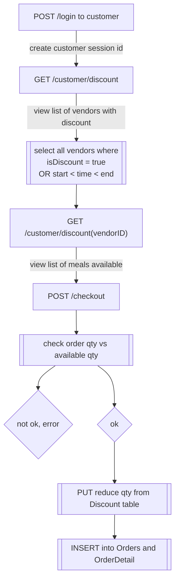

```mermaid
flowchart TB
    id1[POST /login to customer]
    id2[GET /customer/discount]
    
    id3["GET /customer/discount(vendorID)"]
    id4["POST /checkout"]
    id1 -- create customer session id --> id2
    id2 -- view list of vendors with discount --> a
    
    a[["select all vendors where 
    isDiscount = true 
    OR start < time < end"]]
    a --> id3
    id3 -- view list of meals available --> id4
    id4 --> check[["check order qty vs available qty"]]
    check --> notOK{"not ok, error"}
    check --> ok{"ok"}
    ok --> a1[["PUT reduce qty from Discount table"]]
    a1 --> a2[["INSERT into Orders and OrderDetail"]]
    

```