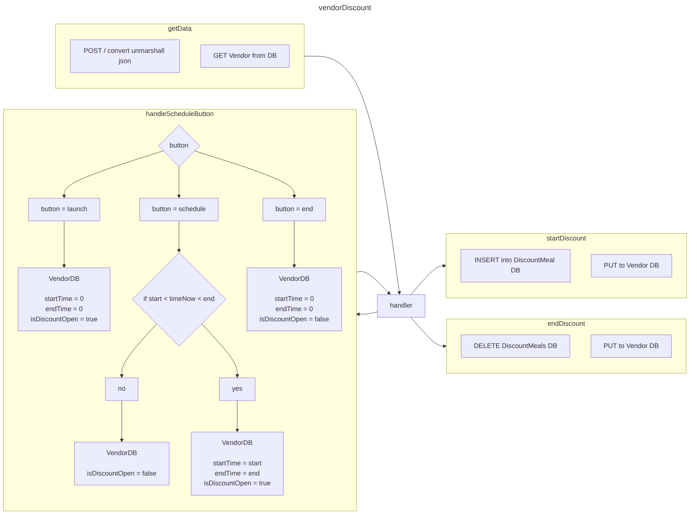

```mermaid
---
title: vendorDiscount
---
flowchart LR
    subgraph getData
        g1["POST / convert unmarshall json"]
        g2["GET Vendor from DB"]
    end
    
    getData -->handler
    handler --> handleScheduleButton --> handler
    subgraph handleScheduleButton
    button{button} --> case1["button = launch"]
    button --> case2["button = schedule"]
    button -->case3["button = end"]
    case1 --> a["VendorDB
        
        startTime = 0
        endTime = 0
        isDiscountOpen = true"]

    case2 --> check{"if start < timeNow < end"}
    check --> yes
    check --> no
    no --> b["VendorDB
    
    isDiscountOpen = false"]
    yes --> c["VendorDB
    
    startTime = start
    endTime = end
    isDiscountOpen = true"]
    
    case3 --> d["VendorDB
    
    startTime = 0
    endTime = 0
    isDiscountOpen = false"]
    end
    
    subgraph startDiscount
        p1["INSERT into DiscountMeal DB"]
        p2["PUT to Vendor DB"]
    end
    handler --> startDiscount

    subgraph endDiscount
        p3["DELETE DiscountMeals DB"]
        p4["PUT to Vendor DB"]
    end
    handler --> endDiscount
    

```